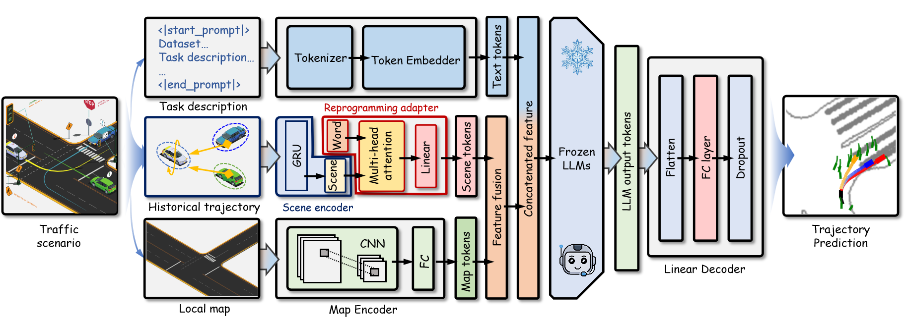

# Frozen LLMs as Map-Aware Spatio-Temporal Reasoners for Vehicle Trajectory Prediction #


## Installation ##


### Environment Setup ###
First, we'll create a conda environment to hold the dependencies.
```
conda env create -f env.yaml
conda activate <environment_name>
```


### Datasets ###
```
/precess_data/preprocess_first_run.py this file will preprocess nuScenes dataset to fit our model .
the data will be precess into .pkl and .index for lazyLoading for training or testing.
```

### Train ###
```
the model is training on 4 48G GPUs using about 10hs one traing we use sbatch to submit our mission
the training script is in this path : trajectory_prediction/train_and_test_result/trajectory_predict_train.py
```

### Test ###
```
the testing script is in this path : trajectory_prediction/train_and_test_result/test_metrics.py
```


