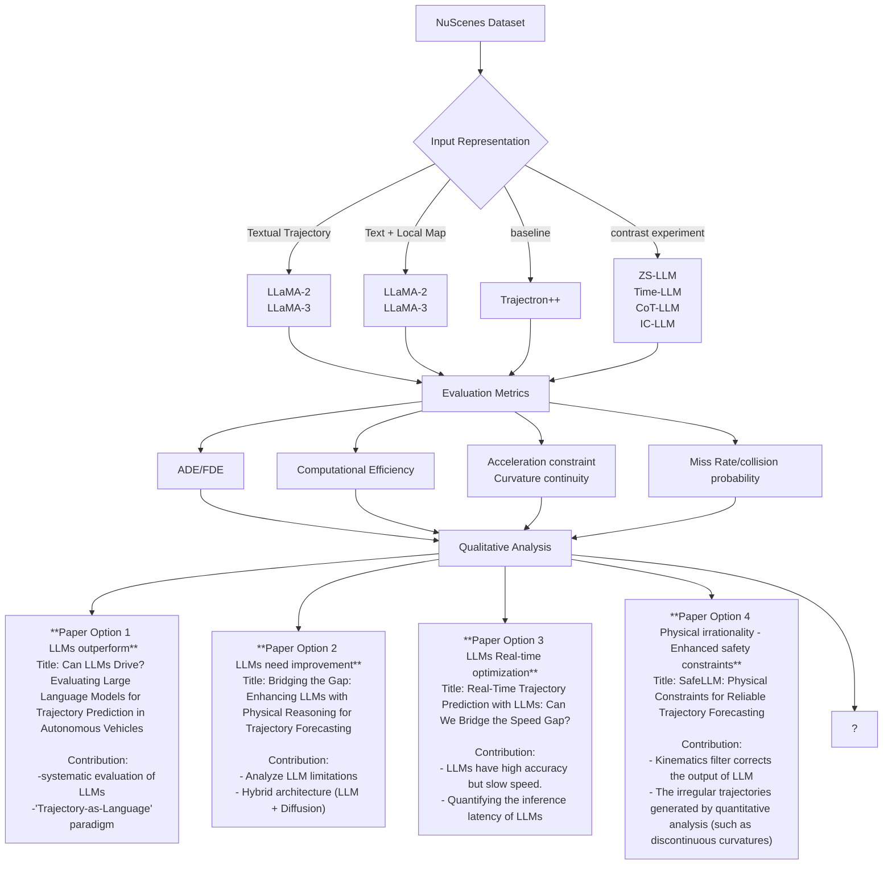

```mermaid
graph TD
    A[NuScenes Dataset] --> B{Input Representation}
    B --> |Textual Trajectory| C[LLaMA-2<br>LLaMA-3<br>]
    B --> |Text + Local Map| D[LLaMA-2<br>LLaMA-3<br>]
    B --> |baseline| E[Trajectron++]
    B --> |contrast experiment | Q[ZS-LLM<br>Time-LLM<br>CoT-LLM<br>IC-LLM<br>]
    C & D & E & Q --> F[Evaluation Metrics]
    F --> G[ADE/FDE]
    F --> H[Computational Efficiency]
    F --> I[Acceleration constraint<br>Curvature continuity]
    F --> J[Miss Rate/collision probability]
    G & H & I & J --> K[Qualitative Analysis]
    K --> L["**Paper Option 1 <br> LLMs outperform**<br>Title: Can LLMs Drive? Evaluating Large Language Models for Trajectory Prediction in Autonomous Vehicles<br>
    Contribution:
    -systematic evaluation of LLMs<br> -'Trajectory-as-Language' paradigm"]
    K --> M["**Paper Option 2 <br>LLMs need improvement**<br>Title: Bridging the Gap: Enhancing LLMs with Physical Reasoning for Trajectory Forecasting
    <br>Contribution:<br>- Analyze LLM limitations<br>- Hybrid architecture (LLM + Diffusion)"]
    K --> N["**Paper Option 3 <br>LLMs Real-time optimization**<br>Title: Real-Time Trajectory Prediction with LLMs: Can We Bridge the Speed Gap?
    <br>Contribution:<br>- LLMs have high accuracy but slow speed.<br>- Quantifying the inference latency of LLMs"]
    K --> O["**Paper Option 4 <br>Physical irrationality - Enhanced safety constraints**<br>Title: SafeLLM: Physical Constraints for Reliable Trajectory Forecasting
    <br>Contribution:<br>- Kinematics filter corrects the output of LLM<br>- The irregular trajectories generated by quantitative analysis (such as discontinuous curvatures)"]
    K --> P[?]

```